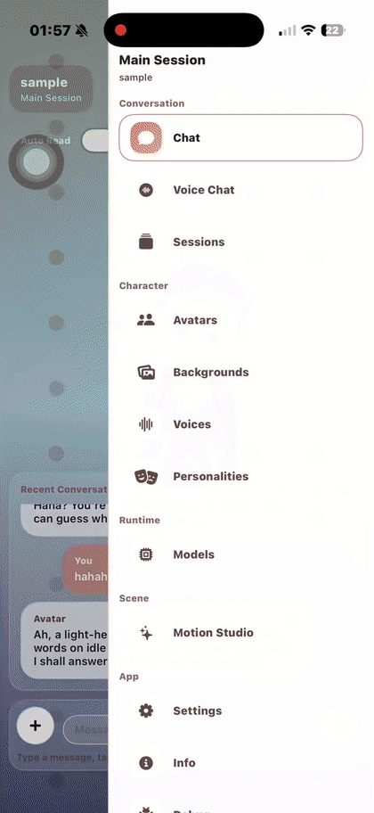
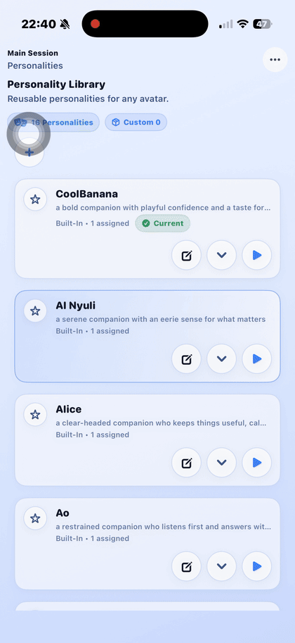

# Najimi

Najimi is a free, privacy-first AI companion for iPhone and Mac. It lets you build a companion experience that feels like yours by choosing and customizing its avatar, voice, personality, and presence.

Najimi is built around offline and on-device use whenever possible. Your chats, voices, avatars, documents, and companion setup are meant to stay close to you, not be leaked to a remote service. Nothing needs to leave your device just to make the experience feel personal.

## What Najimi Is

Najimi is built around a simple idea: your AI companion should feel like someone you spend time with, not just a tool you prompt. It is a companion app where chat, voice, avatars, and presentation all belong to the same experience.

It is designed for people who want something more personal than a generic assistant. You can choose a companion, shape how they present themselves, give them a different voice, assign a different personality, control how they react on screen, bring in your own assets, and use them across both iPhone and Mac.

Najimi also puts real weight on ownership and privacy. Local models, local libraries, and importable assets help make the experience feel more like your own setup instead of a fixed cloud product.

That matters because a companion feels different when it is truly yours. Privacy-first, offline-friendly design means you can talk more freely, customize more deeply, and build a longer-term relationship with your companion without treating every interaction as something that has to be sent away and stored somewhere else.

Follow [@najimi_chat](https://x.com/najimi_chat) on X for the latest updates as Najimi continues to grow.

## What You Can Do

### Collect new reactions, poses, and motions

Najimi is not just about picking a static companion and leaving it there. Your companion can grow a collection of reactions, poses, and motions that make them feel more lively on screen.

You start with a core set of expressions and gestures, then unlock more reactions, poses, and motions as you keep chatting with your companion.

### Choose your companion

Start with one of 15 built-in companions, or import your own avatar packages into the library. Each avatar can become the face of a different companion experience, so choosing a character is not just cosmetic, it defines who you are spending time with in the app.

### Choose their voice

Voices are managed separately from avatars, which means you can mix and match them. You can preview voices, import your own voice assets, and assign a specific voice to a specific companion so each one can sound distinct.

### Shape their personality

Najimi treats personality as its own layer. You can create personality profiles, edit them, and assign them to different companions. This lets you shape how a companion speaks and presents itself in conversation without changing its avatar or voice.

### Customize your space

The app also lets you customize the surrounding presentation of the experience. You can manage backgrounds, choose themes, switch appearance modes, and adjust the overall visual tone so the app feels more like your own space. Najimi includes avatar-scene controls that let you refine how a companion appears on screen. The app exposes controls for things like render mode, camera framing, lighting, shadows, animation smoothness, and scene presentation.

### Talk naturally

You can type when you want to type, and you can talk when you want to talk. Najimi supports spoken interaction so conversations can feel more natural and more alive.

Voice is part of the companion experience, not a separate utility. Replies can be spoken back with character-linked voices and synced with on-screen expression and motion.

### Built on smart small models

Najimi is not just a big generic model dropped into an app. It is built around compact, modern local models chosen for real everyday use, with a strong focus on responsiveness, quality, and running well on personal devices.

The same idea carries into voice. Najimi uses dedicated speech models and supporting systems designed for natural-sounding output, real conversation flow, and smooth companion performance.

### A companion that actually remembers

Najimi is not a naive chat app that forgets everything the moment the screen moves. It is designed to remember important details, carry context forward, and make conversations feel more continuous over time.

Under the hood, that includes a memory system with retrieval-style context injection, RAG-style recall behavior, and conversation history handling that helps bring back the right details when they matter.

It also works to avoid repetitive replies, repeated openings, and recycled phrasing, so the companion feels more present and less like it is falling back to the same stock answer again and again.

### Use built-in tools with your companion

Najimi is not only a chat screen. It is growing into a companion app with built-in tools that you can use inside the same experience.

The Document Reader is the first tool in that system. You can bring in a document, read it inside the app, and talk about it with your companion without breaking the flow.

More tools are planned to grow out of the same foundation, so Najimi can become a place where chat, reading, creation, and companion interaction all live together.

### Keep it local

Najimi is built to work well with local assets and local model workflows. Avatars, voices, backgrounds, and related resources can live as part of your own library, making the experience more portable and more personal.

## Roadmap

Najimi is already usable today, but a lot of the product is still being expanded in layers. Some features are already working internally and being polished for broader release, some are partially built, and some are still future work.

`○` planned  
`◔` early work  
`◑` in progress  
`◕` mostly working, not fully exposed  
`●` active ongoing expansion

### Models

- `◕` Custom model import, so companions can use more than the built-in local model library.
- `◔` Stronger support for VLM and thinking-style models as the app grows beyond text-only chat.
- `◑` Broader local runtime coverage, including more model formats such as GGUF.
- `●` More built-in models over time.

### Voice

- `◑` Voice cloning and richer custom-voice workflows.
- `◑` Multi-language TTS support.
- `◑` Better long-form speech features, including audiobook-style reading flows.

### Avatar and creation tools

- `◕` Avatar movie-maker workflows based on the app’s internal timeline and export tooling.
- `○` Avatar singing.
- `●` More built-in companions and avatar content over time.

### Companion experience

- `◑` VRM 1.0 and RealityKit Support
- `◔` More built-in tools beyond the Document Reader, so companions can help with more kinds of tasks inside the same experience.
- `◑` More polished ways to combine memory, document reading, voice, and performance into one continuous companion experience.

## Open Source

Najimi is being open-sourced gradually. The product is made up of several app-facing systems, runtime packages, and internal tools, and those pieces are being cleaned up and released in stages instead of all at once.

The goal is to make the useful parts of Najimi available as real standalone components, with clearer boundaries, better documentation, and cleaner public structure over time.

Current open-source components in the codebase include:

- [`NajimiMotionPlanerEval`](./NajimiMotionPlanerEval): a standalone Swift package for evaluating local MLX planner models against a planner-format test suite, with valid-format reporting and warm inference metrics.
- [`NajimiPocketTTSMLX`](./NajimiPocketTTSMLX): a standalone MLX-based PocketTTS runtime for on-device speech synthesis, adapted from `mlx-audio` with package cleanup, optimizations, and batch support.
- [`NajimiSileroVADMLX`](./NajimiSileroVADMLX): a standalone MLX-based Silero voice activity detector for streaming speech detection on Apple platforms.
- [`Theme`](./Theme): the current Najimi theme format and bundled theme definitions, with support planned for broader user theme customization and import.
